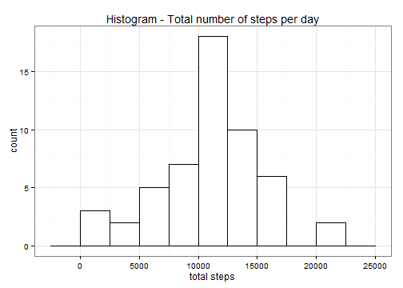
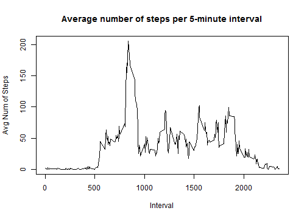
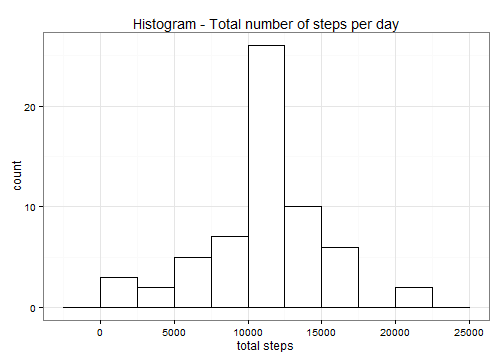
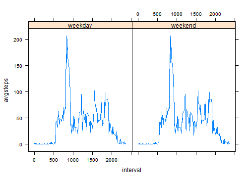

# Assignment 1: Activity monitoring data

## Loading and processing the data

Load the activity monitoring data. 
Set as working directory the folder where the data are saved.


```r
data<- read.csv( "activity.csv",stringsAsFactors = F, header=T)
str(data)
```

```
## 'data.frame':	17568 obs. of  3 variables:
##  $ steps   : int  NA NA NA NA NA NA NA NA NA NA ...
##  $ date    : chr  "2012-10-01" "2012-10-01" "2012-10-01" "2012-10-01" ...
##  $ interval: int  0 5 10 15 20 25 30 35 40 45 ...
```

Transform date from character to date format.


```r
library(lubridate)
data$date <- ymd(data$date)
str(data)
```

```
## 'data.frame':	17568 obs. of  3 variables:
##  $ steps   : int  NA NA NA NA NA NA NA NA NA NA ...
##  $ date    : POSIXct, format: "2012-10-01" "2012-10-01" ...
##  $ interval: int  0 5 10 15 20 25 30 35 40 45 ...
```
## What is the mean total number of steps taken per day

Ignore missing values at this part of the assingment.
Identify missing values and remove them.


```r
sapply(data, function(x) sum(is.na(x)))
dataclean <- data[!is.na(data$steps),]
str(dataclean)
```
Calculate the total number of steps taken per day.


```r
totalsteps <-aggregate(x=dataclean$steps,by=list(dataclean$date),FUN=sum)
names(totalsteps) <- c("date", "totalsteps")
```
Make a histogram of total number of steps per day.


```r
library(ggplot2)
ggplot(totalsteps, aes(x=totalsteps)) + 
        geom_histogram(binwidth=2500, colour="black", fill="white")+
        labs(title = "Histogram - Total number of steps per day", x="total steps")+
        theme_bw()
```

 

Calculate and report the mean and median steps taken per day.


```r
meansteps <- format(round(mean(totalsteps$totalsteps,na.rm=T),2),format="d", big.mark=',')
mediansteps <- format(median(totalsteps$totalsteps, na.rm=T),format="d", big.mark = ',')
```

The mean is 10,766.19 steps. The median is 10,765 steps.

## What is the average daily activity pattern?

Make a time series plot (i.e. type = "l") of the 5-minute interval (x-axis) and the average number of steps taken, averaged across all days (y-axis)


```r
avgsteps <- aggregate(dataclean$steps,list(dataclean$interval),mean)
names(avgsteps) <- c("interval","avgsteps")

plot(x=avgsteps$interval, y=avgsteps$avgsteps,type="l", main = "Average number of steps per 5-minute interval", xlab="Interval", ylab="Avg Num of Steps")
```

 

Which 5-minute interval, on average across all the days in the dataset, contains the maximum number of steps?

```r
maxinter <- format(avgsteps$interval[max(avgsteps$avgsteps)],format="d", big.mark = ',')
```
The maximum number of steps in a 5-minute interval is 1,705.

## Imputing missing values

Calculate and report the total number of missing values in the dataset (i.e. the total number of rows with NAs).


```r
tab <- sapply(data, function(x) sum(is.na(x)))
misCol <- names(tab)[tab>0]
nummiss <- format(sum(tab),format="d",big.mark = ',')
print(tab)
```

```
##    steps     date interval 
##     2304        0        0
```

The total number of missing values in the data set is 2,304. There are no missing dates or intervals. All the missing values are in the variable steps.

We impute the missing data using the mean steps for that particular 5-minute interval and we create a dataset that is equal to the original dataset but with the missing data filled in.


```r
dataimput <-merge(data,avgsteps,by="interval")
dataimput$steps[is.na(dataimput$steps)]<-dataimput$avgsteps[is.na(dataimput$steps)]
dataimput <- dataimput[,1:3]
sapply(dataimput, function(x) sum(is.na(x)))
```

Make a histogram of the total number of steps taken each day.


```r
totalsteps1 <-aggregate(x=dataimput$steps,by=list(dataimput$date),FUN=sum)
names(totalsteps1) <- c("date", "totalsteps")
```


```r
ggplot(totalsteps1, aes(x=totalsteps)) + 
        geom_histogram(binwidth=2500, colour="black", fill="white")+
        labs(title = "Histogram - Total number of steps per day", x="total steps")+
        theme_bw()
```

 

Calculate and report the mean and median steps taken per day.


```r
meansteps1 <- format(round(mean(totalsteps1$totalsteps,na.rm=T),2),format="d", big.mark=',')
mediansteps1 <- format(median(totalsteps1$totalsteps, na.rm=T),format="d", big.mark = ',')
```

The mean is 10,766.19 steps. The median is 10,766.19 steps.
The median is different from the estimates in the first part of the assignment. The median from the imputed data is greater than the median of the clean data. The mean is the same.

## Are there differences in activity patterns between weekdays and weekends?

Create a new factor variable in the dataset with two levels - "weekday" and "weekend" indicating whether a given date is a weekday or weekend day.


```r
tmp <- weekdays(dataimput$date) %in% c("Saturday", "Sunday")
dataimput$day <- factor(tmp, labels=c("weekday","weekend"))
remove(tmp)
```

Make a panel plot containing a time series plot (i.e. type = "l") of the 5-minute interval (x-axis) and the average number of steps taken, averaged across all weekday days or weekend days (y-axis). See the README file in the GitHub repository to see an example of what this plot should look like using simulated data.


```r
avgsteps1 <- aggregate(dataimput$steps,list(dataimput$interval),mean)
names(avgsteps1)<- c("interval","avgsteps")
dataimput <-merge(dataimput,avgsteps,by="interval")

library(lattice)
xyplot( avgsteps~ interval|day, data=dataimput, type='l')
```

 
